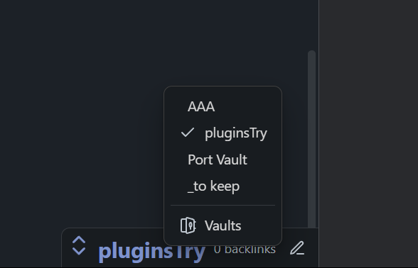
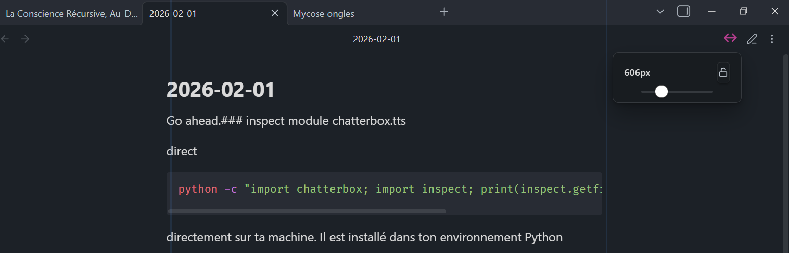
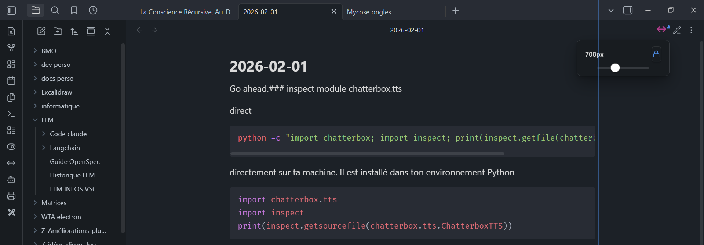

# Vault Name in Status Bar

## Key Features

- **Vault Name in Status Bar:** See your vault name at a glance, with one-click access to the vaults menu.
- **Per-Tab Line Width Control:** Each Markdown tab has its own width control icon. Adjust globally or lock any file to its own width.

## Vault Name

The vault name appears in the status bar. Click it to open the vaults menu for quick switching. You can customize its color, font size, and maximum display length — or hide it entirely.

## Line Width Control

Each Markdown tab has a `<->` icon in its top-right header. Click it to open a width slider (300px–1600px). Visual guides appear on both sides of the editor while adjusting.

The slider works across all windows — including split panes and secondary windows.

**Global mode (lock open):** the slider adjusts the width for all unlocked files.

**Local mode (lock closed):** the slider adjusts the width for this file only. A small lock badge appears on the icon as a reminder.

Clicking the lock again removes the local override and reverts to the global width.

### Disabling the feature

Disabling "Enable Line Width Control" in settings hides all icons and restores the default Obsidian line width. Re-enabling it restores your previous settings.

## Settings

**Vault Name**
- **Enable vault name**: Show/hide the vault name
- **Vault Name Color**: Color of the vault name
- **Font Size**: Font size of the vault name (in em)
- **Enable Maximum Length**: Truncate the vault name if too long
- **Maximum Length**: Max characters to display

**Editor Line Width**
- **Enable Line Width Control**: Show/hide the width control icons
- **Line Width Color**: Color of the `<->` icon
- **Restore cursor on popup close**: When enabled, closing the popup restores the cursor position and selection to where it was when the popup was opened

## Installation

1. Copy files from the release
2. Install them in `your-vault/.obsidian/plugins/status_vault_bar` or use BRAT

## Support

Issues and suggestions: [GitHub repository](https://github.com/3C0D/Obsidian-Vault-Name-in-Status-Bar).

## License

MIT License.

## Development

This plugin uses a template that automates the development and publication processes on GitHub, including releases. You can develop either inside or outside your Obsidian vault.

### Environment Setup

- `main.ts` and `styles.css` must be in the `src` folder.
- After building, `styles.css` will appear in the root folder (this is normal for the release process).

#### Development Options:
1. **Inside the vault's plugins folder:**
   - Delete the `.env` file.
   - Run npm commands as usual.

2. **Outside the vault:**
   - Set the paths in the `.env` file:
     - `TestVault` for development
     - `RealVault` for production simulation
   - Necessary files will be automatically copied to the targeted vault.

### Available Commands

- `npm run start`: Opens VS Code, runs `npm install`, then `npm run dev`
- `npm run dev`: For development
- `npm run build`: Builds the project
- `npm run real`: Simulates a traditional plugin installation in your REAL vault
- `npm run bacp`: Builds, adds, commits, and pushes (prompts for commit message)
- `npm run acp`: Adds, commits, and pushes (without building)
- `npm run version`: Updates version, modifies relevant files, then adds, commits, and pushes
- `npm run release`: Creates a GitHub release (prompts for release title, can be multiline using `\n`)

### Recommended Workflow

1. `npm run start`
2. `npm run bacp`
3. `npm run version`
4. `npm run release`

### Additional Features

- **obsidian-typings**: This template automatically includes obsidian-typings, providing access to additional types not present in the official API.