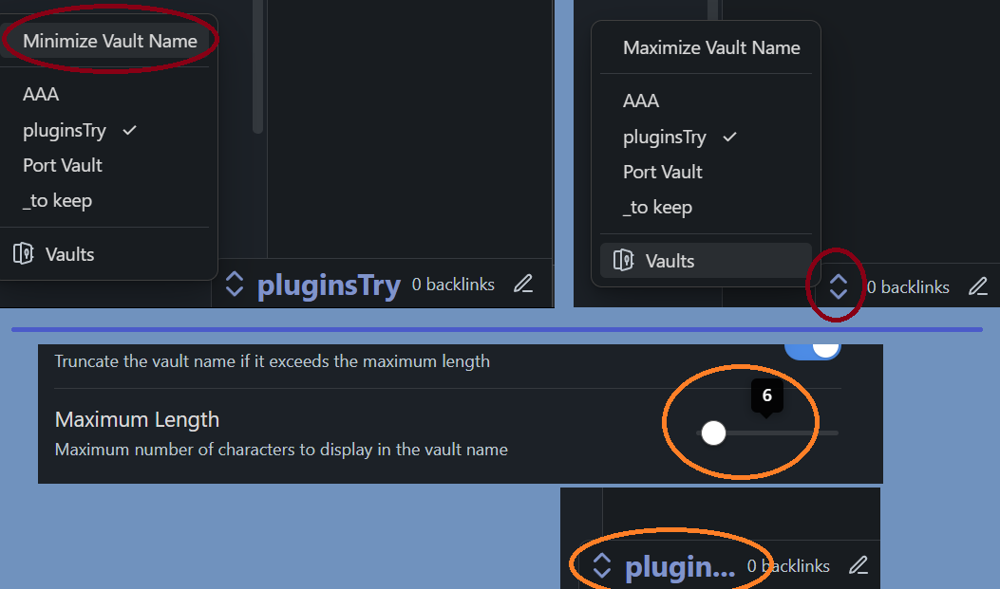

# Vault Name in Status Bar

## Key Features:

- **Dynamic Vault Display:** Instantly view your current vault's name in the Obsidian status bar.
- **Customizable Appearance:** Personalize the display to match your workspace, ensuring a seamless integration.
- **Vaults Menu:** One-click access to the vaults menu for easy navigation. 

## Benefits:

- **Enhanced Efficiency:** This plugin provides the advantage of keeping this information always visible in the status bar, and providing another quick access to the vaults menu.

## Features

- Displays your current vault name in the status bar
- Click to open a menu for quick vault switching
- Customizable appearance
- Vaut name length customizable

## Settings

- **Color**: Choose the color of the vault name in the status bar
- **Font Size**: Adjust the font size of the vault name (in em)
- **Enable Maximum Length**: Option to truncate the vault name if it exceeds the maximum length
- **Maximum Length**: Set the maximum number of characters to display in the vault name

## Usage

- The vault name appears in the status bar
- Click on the vault name to open a menu with options to switch to other vaults or manage vaults
- The current vault is indicated with a checkmark in the menu

## Installation

1. copy files from the release
2. install them in your vault/.obsidian/plugins/status_vault_bar or use Brat

## Support

If you encounter any issues or have suggestions for improvements, please open an issue on the [GitHub repository](https://github.com/3C0D/Obsidian-Vault-Name-in-Status-Bar).

## License

This project is licensed under the MIT License.

## Development

This plugin uses a template that automates the development and publication processes on GitHub, including releases. You can develop either inside or outside your Obsidian vault.

### Environment Setup

- `main.ts` and `styles.css` must be in the `src` folder.
- After building, `styles.css` will appear in the root folder (this is normal for the release process).

#### Development Options:
1. **Inside the vault's plugins folder:**
   - Delete the `.env` file.
   - Run npm commands as usual.

2. **Outside the vault:**
   - Set the paths in the `.env` file:
     - `TestVault` for development
     - `RealVault` for production simulation
   - Necessary files will be automatically copied to the targeted vault.

### Available Commands

- `npm run start`: Opens VS Code, runs `npm install`, then `npm run dev`
- `npm run dev`: For development
- `npm run build`: Builds the project
- `npm run real`: Simulates a traditional plugin installation in your REAL vault
- `npm run bacp`: Builds, adds, commits, and pushes (prompts for commit message)
- `npm run acp`: Adds, commits, and pushes (without building)
- `npm run version`: Updates version, modifies relevant files, then adds, commits, and pushes
- `npm run release`: Creates a GitHub release (prompts for release title, can be multiline using `\n`)

### Recommended Workflow

1. `npm run start`
2. `npm run bacp`
3. `npm run version`
4. `npm run release`

### Additional Features

- **obsidian-typings**: This template automatically includes obsidian-typings, providing access to additional types not present in the official API.